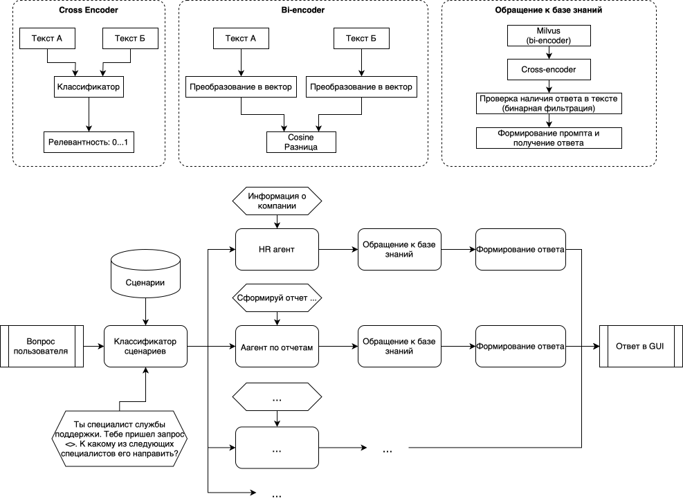
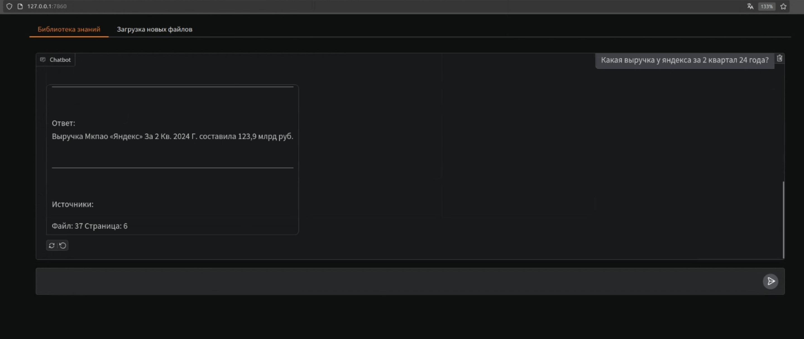
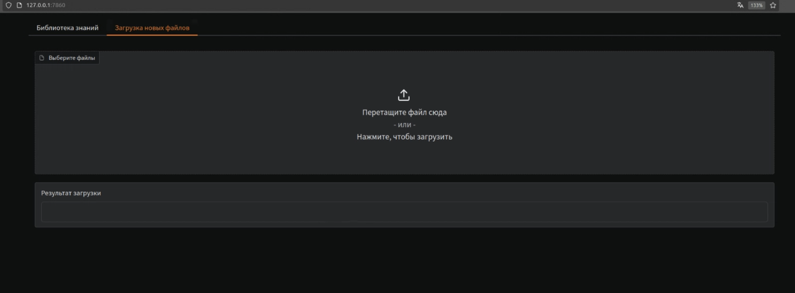

# Система поиска и получения информации из библиотеки знаний
## <div align="center">Описание</div>
Мы представляем решение для поиска информации по библиотеке знаний, основанное на современных больших языковых моделях, способных быстро и точно отвечать на поставленные вопросы. Наше решение позволяет быстро и эффективно отвечать на вопросы по документам из библиотеки знаний, формировать аналитический отчёт по запросу, расширять область знаний модели путём добавления новых документов сразу через пользовательский интерфейс решения. Одной из ключевых особенностей нашего решения является кастомная интерпретация агентов (отраслевых специалистов) в виде дерева решений, что позволяет достигнуть большей точности и избегать галлюцинаций.

Технологический стэк: Python, Milvus, Gradio, ollama, Llama 3.1:8b. Благодаря этому решению специалисты маркетингового агентства, могут оперативно выделять нужную информацию из большой документной базы с указанием источника, что позволит максимально быстро и эффективно ориентироваться в большом объеме данных.

## <div align="center">Структура системы поиска и получения информации</div>
  





## <div align="center">Документация</div>
### Необходимые библиотеки
```
pip install gradio==5.5.0
pip install gradio_client==1.4.2
pip install huggingface-hub==0.26.2
pip install marker-pdf==0.3.10
pip install ollama==0.3.3
pip install openpyxl==3.1.5
pip install pymilvus==2.4.9
pip install PyMuPDF==1.24.13
pip install pymupdf4llm==0.0.17
pip install PyPDF2==3.0.1
pip install sentence-transformers==3.2.1
```

Установка библиотек:
```
python3 -m pip install -r requirements.txt
```

### Запуск 

Запуск системы с интерфейсом:
```bash
python gradio_gui.py
```

Запуск системы в терминале с режимом отладки:
```bash
python rag.py
```

Запуск анализа файла системой:
```bash
python submission_maker.py
```

## <div align="center">Скриншоты</div>




## <div align="center">Лицензия</div>
```
MIT License

Copyright (c) 2024 " or ""="

Permission is hereby granted, free of charge, to any person obtaining a copy
of this software and associated documentation files (the "Software"), to deal
in the Software without restriction, including without limitation the rights
to use, copy, modify, merge, publish, distribute, sublicense, and/or sell
copies of the Software, and to permit persons to whom the Software is
furnished to do so, subject to the following conditions:

The above copyright notice and this permission notice shall be included in all
copies or substantial portions of the Software.

THE SOFTWARE IS PROVIDED "AS IS", WITHOUT WARRANTY OF ANY KIND, EXPRESS OR
IMPLIED, INCLUDING BUT NOT LIMITED TO THE WARRANTIES OF MERCHANTABILITY,
FITNESS FOR A PARTICULAR PURPOSE AND NONINFRINGEMENT. IN NO EVENT SHALL THE
AUTHORS OR COPYRIGHT HOLDERS BE LIABLE FOR ANY CLAIM, DAMAGES OR OTHER
LIABILITY, WHETHER IN AN ACTION OF CONTRACT, TORT OR OTHERWISE, ARISING FROM,
OUT OF OR IN CONNECTION WITH THE SOFTWARE OR THE USE OR OTHER DEALINGS IN THE
SOFTWARE.
```